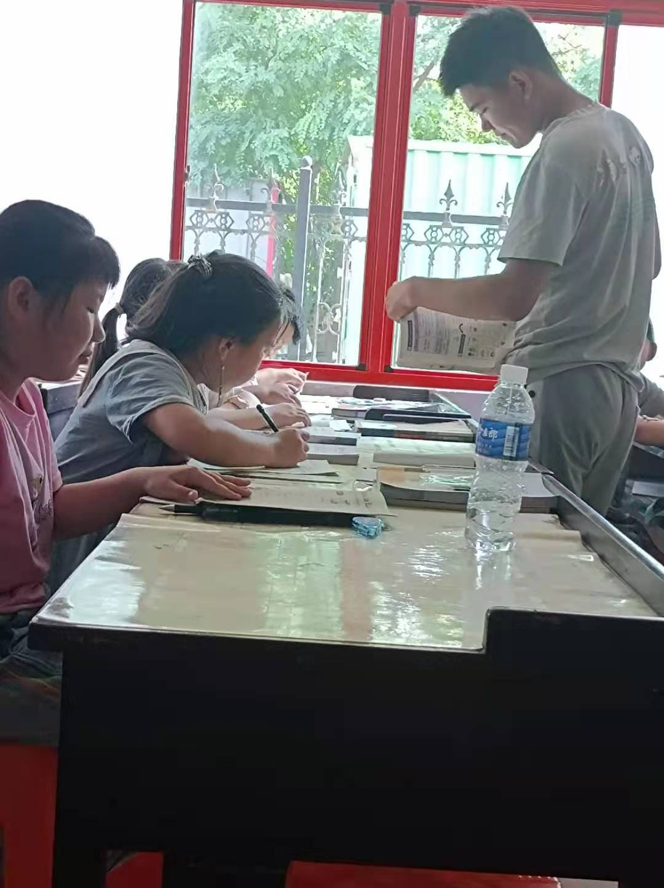
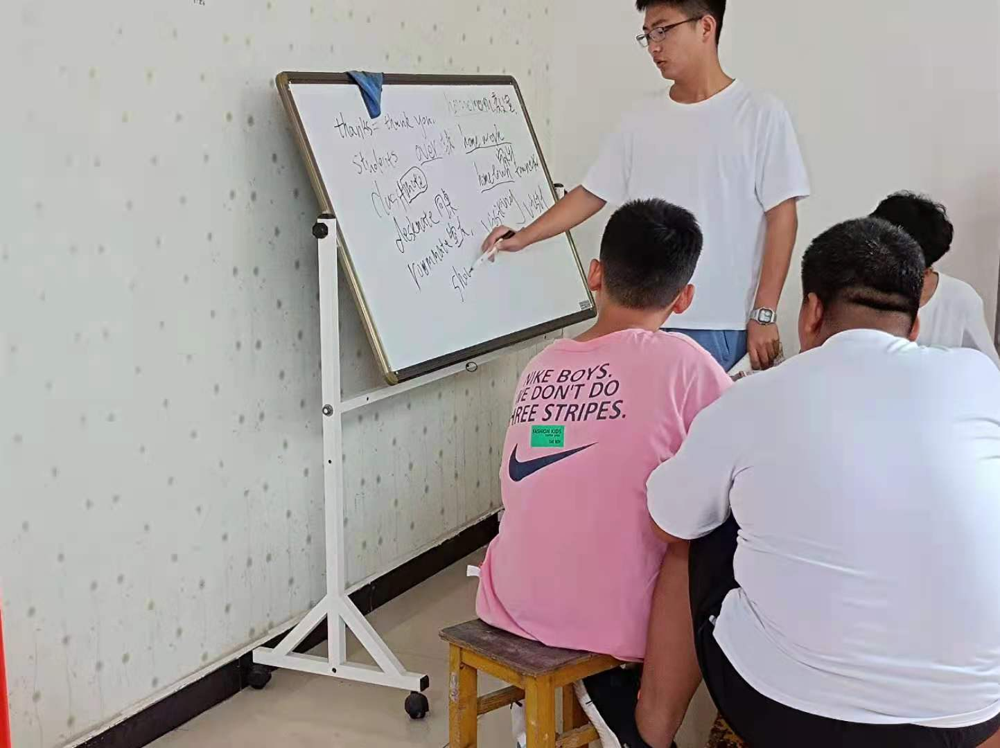
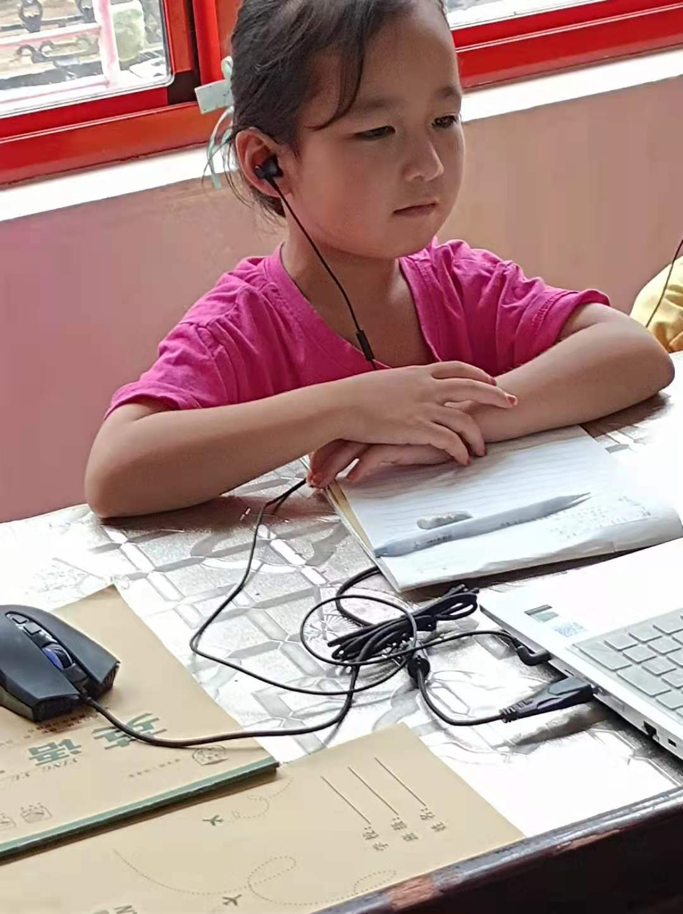
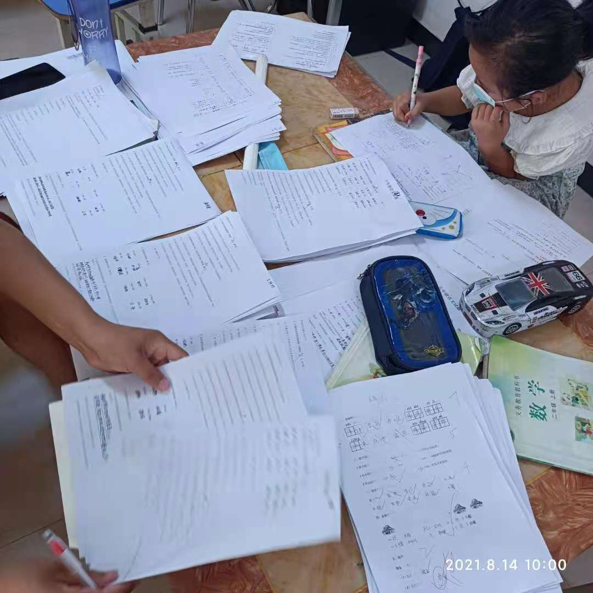

<html>
 <head>
  <title> 小清华补习班 </title>
  <meta name="generator" content="editplus" />
  <meta name="author" content="" />
  <meta name="keywords" content="" />
  <meta name="description" content="" />
    
   
 </head>

<body>
   
<a href="#">补习班中的-小清华</a>

 
数学授课中
 
英语授课中
 
语文授课中
 
考试中

</body>
</html>
